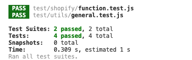

# Shopify Product Variant Fetcher

This project is a Node.js script that interfaces with Shopify's GraphQL API to fetch products based on the provided product name. It retrieves and displays the product variants sorted by price.

## Table of Contents

- [Requirements](#requirements)
- [Setup](#setup)
- [Usage](#usage)
- [Unit Tests](#unit-tests)


## Requirements

- Node.js v14 or later
- Access to the Shopify store admin

## Setup

1. **Clone the repository:**

    ```bash
    git clone https://github.com/Omdaprog/Anatta-assignment.git
    cd Anatta-assignment

    ```

2. **Install dependencies:**

    ```bash
    npm install
    ```

## Usage

This script fetches and lists the variants for a product based on the input name.

Run the script using the command:

```bash
node app.js --name "<product name>"
```
## Unit Tests

This project includes unit tests to ensure the functionality of key components. The test suite covers:

- **function.test.js** in the `test/shopify/` directory
- **general.test.js** in the `test/utils/` directory

To run the tests, use the following command:

```bash
npm test
This image shows the successful output of a unit test suite for the project. The test summary indicates:

- **Test Suites**: 2 passed out of 2 total
- **Tests**: 4 tests passed in total
- **Snapshots**: 0 snapshots used
- **Time**: The tests completed in 0.309 seconds, with an estimated duration of 1 second

Each test suite (`function.test.js` in `test/shopify/` and `general.test.js` in `test/utils/`) has passed, confirming that the key components are functioning as expected.


